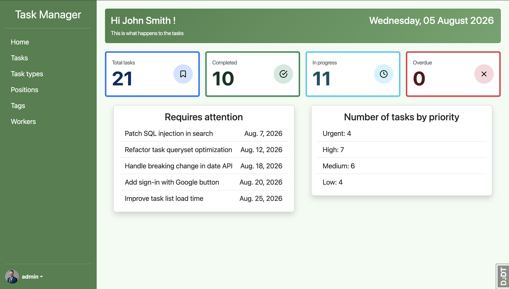
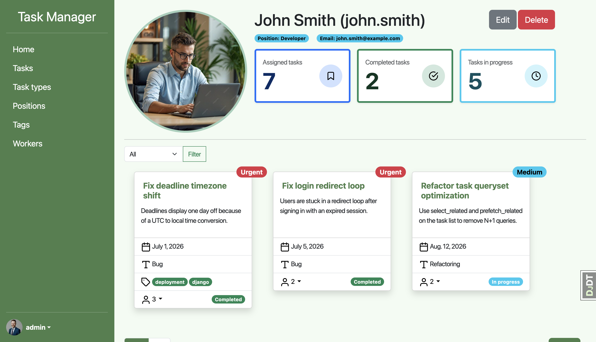
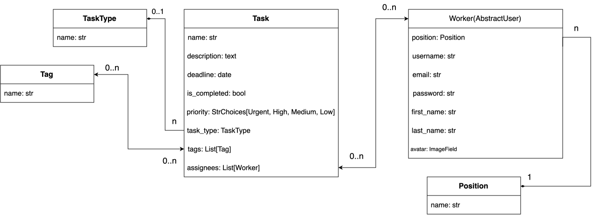

# Task Manager
A web app for managing team tasks: who is working on what, deadlines, priorities, tags.

https://task-manager-5tu4.onrender.com
(first load may take ~30–60s — free Render instance spins down when idle)

## Screenshots of the web application




## DB structure


## Features
1. Implemented full CRUD functionality for the following models:
   - Task
   - TaskType
   - Position
   - Worker
   - Tag
2. Dashboard with statistics:
   - Current date
   - Task statistics(total tasks, completed, in progress, overdue)
   - Top 5 immediate tasks
   - Number of tasks by priority
3. Search and filters:
   - Search by name on pages: Tasks, Task types, Positions, Tags
   - Search by username on pages Workers
   - Filtering the worker's detailed page by status(All/Completed/In progress)
4. Authentication
   The web application is only available to logged in users.
5. Deadline validation
   Implemented task deadline validation restricted to current or future dates.
   This validation allows updates to tasks with past-due deadlines.
6. Avatars
   Implemented a custom avatar upload feature for user profiles.

## Technology stack
   - Python 3.12
   - Django 6.0
   - Bootstrap 5
   - SQLite (local)
   - PostgreSQL (production)
   - crispy-forms
   - django-select2
   - django-debug-toolbar
   - Pillow
   - gunicorn
   - whitenoise

## Installation and launch

```bash
git clone https://github.com/rinotokun/task-manager.git
cd task-manager
python -m venv venv
source venv/bin/activate # macOS
# venv\Scripts\activate # Windows
pip install -r requirements.txt
python manage.py migrate
python manage.py loaddata task_manager_data
python manage.py runserver
```

## Live demo
https://task-manager-5tu4.onrender.com

- **Login:** `chris.martin`
- **Password:** `Test123!!!`

## Tests
Tests can be run with the command `python manage.py test`.
Wrote comprehensive tests covering forms, models, views, and admin configurations.
